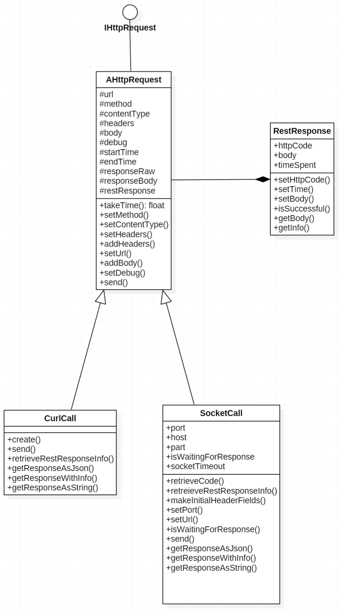

# PHP HTTP Client Library
Small Library to help clients send HTTP Requests
and hide the implementation of libcurl or fsockopen.

###Usage
```
// with curl
$restCall = new RestCall("Curl");
    $restCall->setUrl("http://webapi.ddns.net/index.php/mockcontroller/1001")
        ->setContentType("application/json")
        ->addBody(["aaa" => "dsdd"])
        ->setMethod("POST");
    
// give it array as headers 
$restCall->setHeaders( [ "ApiToken" => "some_token"]);
// or you add to the headers as key value pair
$restCall->addHeader("SomeHeader", "SomeValue");

// make the call
$restCall->send();

// get the response as string
$str = $restCall->getResponseAsString();
// or get the response as JSON
$json = $restCall->getResponseAsJson();
    
// with socket
$restCall = new RestCall("Socket");
$restCall->setUrl("http://webapi.ddns.net/index.php/mockcontroller/1001")
     ->setContentType("application/json")
     ->setMethod("GET");
 
// give it array as headers 
$restCall->setHeaders( [ "ApiToken" => "some_token"]);
 
// make the call
restCall->send();
    
```

###UML Class Diagram



